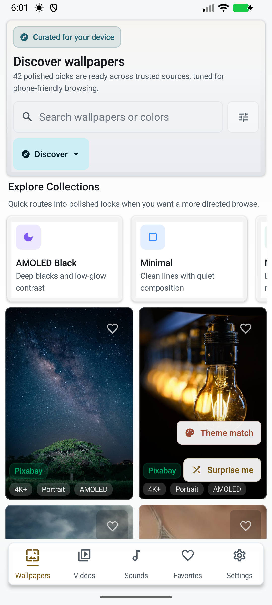

<p align="center">
  
</p>

<h1 align="center">Aura</h1>


> Open-source alternative to Zedge: wallpapers, video wallpapers, ringtones, and sounds for Android. **YouTube integration, yt-dlp powered.**



## What Makes Aura Different

Aura is built as a local-first tool rather than an ad-and-credit marketplace:

| Area | Aura behavior |
|------|---------------|
| **Advertising** | No ad SDK, sponsored placements, or cross-app tracking. |
| **Account** | Browsing, downloading, editing, applying, and backing up content do not require an Aura account; community features use an anonymous app identity. |
| **Credits and paywalls** | No Aura credit balance, subscription, or in-app paywall. In full builds, optional Stability AI generation uses the user's own provider key and may consume Stability credits. |
| **AI-generated content** | Generation is off by default in full builds and omitted from FOSS builds. Declared AI uploads are labeled, Aura-generated uploads are labeled automatically, and community feeds provide a Hide AI filter. |
| **Offline library** | Downloads and offline favorites stay on the device for local use. Portable backups carry favorites, collections, searches, wallpaper packs, and sound profiles without exporting device-specific download paths. |

- **Quality-ranked YouTube sounds**: ringtones, notifications, and alarms use intent-specific YouTube searches with tight duration windows and cleaner result filtering.
- **Reddit-first discovery**: mobile wallpaper and motion communities lead the home feeds, with real cached Atom cursor pagination instead of a fixed recent slice.
- **Video wallpapers from multiple sources**: browse Reddit live wallpapers/cinemagraphs first, followed by YouTube, Pixabay, and Pexels; import local videos/GIFs, then tune loop, crop, Fill, or Fit before applying.
- **Multi-source personalization**: Reddit RSS, Wallhaven, Bing, Pexels, Pixabay, YouTube, legacy Freesound attributions, and community uploads.
- **Instant startup**: Discover feed is cached locally. On subsequent launches wallpapers appear immediately while fresh results load in the background.
- **Performance proof path**: Baseline Profile and Macrobenchmark tests cover startup, Wallpaper Detail, and the main media grids on a physical-device runner.
- **5 bottom nav tabs**: Wallpapers, Videos, Sounds, Library, Settings.

## Installing Aura

Every release ships one APK per CPU architecture plus a universal one, and a
single `SHA256SUMS.txt` covering all of them, on the same
[GitHub Release](https://github.com/SysAdminDoc/Aura/releases).

Pick the one that matches your phone. Almost every Android phone made since 2017
is `arm64-v8a`, and that build is roughly a third the size of the universal one
because it carries native code for one architecture instead of four. `armeabi-v7a`
is for older 32-bit devices; the `x86` builds are for emulators. If you are not
sure, the universal APK installs anywhere. Obtainium picks the right one on its
own with `autoApkFilterByArch` enabled, which the bundled
[`obtainium.json`](obtainium.json) already sets.

Do not install debug or third-party re-signed builds.

FOSS store builds omit the Stability AI generator, its provider key field, and
Firebase-backed community features. Full GitHub builds retain those optional
features, with generation disabled until the user enables it and accepts its
disclosure.

Verify the download, then install or update it with ADB:

```powershell
Get-FileHash .\Aura-vX.Y.Z-versionCode-N-arm64-v8a-release.apk -Algorithm SHA256
adb install --user 0 -r .\Aura-vX.Y.Z-versionCode-N-arm64-v8a-release.apk
```

Compare the printed digest with `SHA256SUMS.txt` before installing. The `-r`
update keeps app data only when the installed app and new APK use the same
signing certificate. If Android reports a signature mismatch, obtain the
official matching Aura build; uninstalling would erase local app data.

Official Aura builds are signed with this certificate:

```text
SHA-256: F2:8E:44:BE:A3:2F:5B:28:90:C8:26:8B:7F:BE:D4:3C:44:A4:D6:71:A5:12:FB:07:EB:F1:8F:DD:41:C6:6E:5A
```

Every release since v6.38.1 carries it. Check it with
`apksigner verify --print-certs <apk>` or with
[AppVerifier](https://github.com/soupslurpr/AppVerifier) before installing a
build you did not download from Aura's own releases page. A different digest
means a re-signed APK, whatever the version number says.

Android's developer-verification rollout begins on September 30, 2026 for
participating stores in Brazil, Indonesia, Singapore, and Thailand, then expands
globally in 2027. Unregistered APKs remain installable through ADB. Android is
also launching a one-time advanced flow in August 2026 for power users who
enable developer mode, acknowledge the security warnings, and complete its
24-hour waiting period. Follow the on-device advanced flow when the normal
package installer declines an unregistered APK; the wait does not apply to ADB.
See Android's [verification FAQ](https://developer.android.com/developer-verification/guides/faq)
and Aura's [verification decision record](docs/distribution/developer-verification.md).

## Quick Start

```bash
git clone https://github.com/SysAdminDoc/Aura.git
cd Aura
```

Open in Android Studio and run. Core browsing works out of the box; optional provider keys can be added later in Settings or `local.properties`.

YouTube extraction works without account credentials. For networks where YouTube
requires proof-of-origin tokens, Settings > Sounds > YouTube PO token provider
accepts the credential-free HTTPS base URL of a self-hosted
[bgutil provider](https://github.com/Brainicism/bgutil-ytdlp-pot-provider). Aura
ships its hash-pinned yt-dlp plugin but sends attestation data only after this
optional URL is configured; see yt-dlp's [PO Token Guide](https://github.com/yt-dlp/yt-dlp/wiki/PO-Token-Guide).

Choosing **Update yt-dlp** in Settings downloads a replacement executable at
runtime. Aura requires a separate confirmation that explains this bypasses
F-Droid or other repository review checks before the download can start.

## Privacy

Aura has no ads, no subscription, and no cross-app tracking. The public privacy
policy is tracked at [docs/privacy/privacy-policy.md](https://github.com/SysAdminDoc/Aura/blob/main/docs/privacy/privacy-policy.md);
the same link is available in Settings > About > Privacy policy.

## Features

| Feature | Description |
|---------|-------------|
| **HD/4K Wallpapers** | Discover feed from Wallhaven, Pexels, Pixabay & Bing |
| **Wallpaper Quality Filters** | Discover chips for For You, AMOLED, 4K+, Portrait, and Icon Safe with curated ranking |
| **On-Device Style Learning** | Apply, favorite, and hide signals adapt Discover locally with a Settings reset control |
| **Community Wallpapers** | Upload phone-cropped gallery images with tags, Palette colors, and community voting |
| **HEIF/AVIF Wallpaper Import** | Local apply, editor, rotation, and community upload flows share one format policy with HEIF support and Android 14+ AVIF gating |
| **Creator Profiles** | View upload stats, votes, followed creators, followed uploads, and top creator leaderboard |
| **Shareable Collections** | Share wallpaper collections as Aura links, QR codes, or JSON files and import them on another device |
| **Video Wallpapers** | Browse YouTube video wallpapers with ExoPlayer auto-preview or import local clips/GIFs |
| **Video Feed Pagination** | Warm-cache loading and pagination share one request gate, so provider results aren't duplicated or dropped |
| **Video Quality Hints** | Loop-safe, low-battery, and phone-fit filters plus per-card motion hints |
| **Video Fit Modes** | Fill for full-screen crop or Fit to preserve the full frame |
| **Video Loop & Crop Editor** | Trim intros/outros with frame thumbnails, preview the loop, and convert landscape videos to portrait |
| **Video Battery Dashboard** | Live wallpaper-service heartbeat, battery status, effective FPS, and automatic low-battery capping |
| **Parallax Wallpapers** | ML Kit depth segmentation for layered tilt-responsive live wallpapers |
| **Weather Wallpapers** | Live weather effects overlay on wallpapers |
| **Shader Wallpapers** | Curated AGSL live wallpaper backgrounds with static fallback on older Android releases |
| **Live Wallpaper Instances** | Android 16 descriptions keep selected video, parallax, and weather settings with a legacy fallback on older releases |
| **Download Progress** | Download notifications use the Android 16 progress style when available and retain the compatibility progress bar elsewhere |
| **Touch-Reactive Effects** | Optional ripple and sparkle bursts on live wallpaper touches |
| **YouTube Sounds** | YouTube-first ringtone, notification, and alarm discovery with duration-aware searches powered by NewPipe + yt-dlp |
| **Community Sound Uploads** | Pick or record sounds, tag them, vote on community picks, and share via Firebase Storage |
| **Sound Source Badges** | Color-coded source indicators on every sound card |
| **Sound Quality Filters** | Best, Clean, Short, Calm, and Punchy filters with intent-aware badges |
| **Real-Time Waveform** | Mini waveform on each sound card tracks actual playback position |
| **Configurable Search** | Customize YouTube search queries and blocked words per sound tab |
| **Ringtones & Sounds** | Tab-based browsing: Ringtones (5-45s), Notifications (0-8s), Alarms (5-60s) |
| **Sound Editor** | Waveform trim, fades, pitch-preserving 0.5x to 2x speed, Media3 audio export, gapless OGG output, verified lossless cuts, and MP3/FLAC fallback encoding |
| **Wallpaper Editor** | Brightness, contrast, saturation, blur, depth portraits, and local text/sticker layers |
| **Crop & Position** | Pinch-zoom with aspect ratio presets (9:16, 16:9, 1:1) |
| **Collections** | Organize wallpapers into named folders with 2x2 cover previews |
| **Home Widget** | Glance-based widget for quick shuffle with error feedback |
| **Quick Settings Action** | Add “Next wallpaper” from the system tile editor for one-tap rotation, even while automatic rotation is off |
| **Auto Wallpaper** | Rotation schedule with one source, clock-based day/night sources, or system light/dark theme matching |
| **Shuffle FAB** | One-tap random wallpaper from current tab |
| **Per-Contact Ringtones** | Assign custom ringtones with DND priority guidance and a VIP-only silent-default preset |
| **Dual Wallpapers** | Coordinated home + lock screen wallpaper pairs |
| **Favorites Export** | JSON export/import with full metadata via Android SAF |
| **Theme Packs** | Local zip export/import for wallpaper, video, sound, widget tint, and launcher shortcut recipes |
| **Community Voting** | Upvote/downvote wallpapers and sounds via Firebase |
| **OLED Dark Theme** | Deep blacks, zero burn-in, Material 3 |

## External Automation

Aura exposes two optional broadcast actions for Tasker, MacroDroid, adb, and
Termux users:

```text
com.freevibe.action.ROTATE_NOW
com.freevibe.action.SHUFFLE_NOW
```

Enable them in Settings > Wallpaper rotation > External automation before
sending broadcasts. Aura ignores external broadcasts by default, accepts at most
one every 30 seconds, and records the last action plus the optional
`com.freevibe.extra.CALLER_PACKAGE` diagnostic extra in Settings > Diagnostics.
Broadcasts only enqueue the existing rotation worker, so charging, Wi-Fi, idle,
battery, Doze, and WorkManager quota can still delay the wallpaper change.
The same one-shot path powers the optional **Next wallpaper** Quick Settings
tile. Add it from Android's tile editor; its active state mirrors automatic
rotation, while tapping it still queues one wallpaper change when scheduling is off.

## Content Sources

| Source | Content | Auth |
|--------|---------|------|
| [Wallhaven](https://wallhaven.cc) | 1M+ HD/4K wallpapers | None (optional key for NSFW) |
| [Pexels](https://pexels.com) | Curated HD photos + videos | Built-in key |
| [Pixabay](https://pixabay.com) | Editor's choice photos + videos | Built-in key |
| [Reddit](https://reddit.com) | Reddit-first mobile wallpapers, live wallpapers, and cinemagraphs via 100-entry public Atom pages with cursor pagination, a two-hour cache, and stale fallback | None |
| [YouTube](https://youtube.com) | Video wallpapers + active sound feed via NewPipe + yt-dlp | None |
| [Freesound](https://freesound.org) | Legacy sound attribution for older favorites | Built-in key |
| Firebase | Community wallpaper/sound uploads + voting | Built-in |

## Architecture

```
Jetpack Compose UI (16+ screens, 5 bottom nav tabs)
  Wallpapers | Videos | Sounds | Library | Settings
  Editors | Collections | Downloads | Onboarding | Widget
ViewModels (Hilt) + Cache Layer
  Repos: Wallhaven, Pexels, Pixabay, Bing, Reddit RSS, YouTube, Freesound legacy,
         Collections
  Services: WallpaperApplier, SoundApplier, VideoWallpaperService,
            ParallaxWallpaperService, WeatherWallpaperService, DualWallpaperService,
            DownloadManager, AudioTrimmer, BatchDownload,
            ContactRingtone, FavoritesExporter, OfflineFavorites
  Audio: Media3 platform transforms + bounded FFmpeg codec fallbacks
  YouTube: NewPipe Extractor (search) + yt-dlp (stream extraction + FFmpeg crop)
Room DB v17 (Favorites, Downloads, Search History, Wallpaper Cache,
            Wallpaper History, Collections)
DataStore (Settings, Onboarding)
Firebase RTDB (Community Voting + Uploads + Admin Moderation)
```

## Tech Stack

| Component | Library |
|-----------|---------|
| UI | Jetpack Compose + Material 3 |
| DI | Hilt 2.53.1 |
| Database | Room 2.7.2 |
| Network | Retrofit 3.0.0 + OkHttp 5.4.0 |
| JSON | Moshi + KSP codegen |
| Images | Coil 3.5.0 with OkHttp network loading and GIF support |
| Audio/Video | Media3 ExoPlayer |
| ML | ML Kit Selfie Segmentation |
| YouTube Search | NewPipe Extractor |
| YouTube Streams | yt-dlp (youtubedl-android 0.18.1) |
| Scheduling | WorkManager 2.11.2 |
| Widget | Glance 1.2.0-rc01 |
| Performance | Baseline Profile + Macrobenchmark 1.4.1 |
| Min SDK | 26 (Android 8.0) |
| Target SDK | 35 (Android 15) |
| Kotlin | 2.1.0 |

## Building

Requires JDK 21 and Android SDK 36. Android Studio Ladybug (2024.2.1) or later recommended.

```bash
./gradlew assembleDebug      # use gradlew.bat on Windows
./gradlew testDebugUnitTest
./gradlew lintDebug
./gradlew assembleFullRelease  # requires signing config
./gradlew bundleFullRelease    # run separately: ABI splits switch off while bundling
```

> Always use the included Gradle wrapper. It pins Gradle 8.12, which is what AGP 8.9.3 needs.

The legacy Android test lane runs against release-minified Full and FOSS APKs. It
opens Sounds and exercises NewPipe search on API 26, 27, and 29 without requiring
network access. Build its target and test APKs with:

```powershell
.\gradlew.bat -PauraInstrumentationBuildType=release `
    :app:assembleFullRelease :app:assembleFossRelease `
    :app:assembleFullReleaseAndroidTest :app:assembleFossReleaseAndroidTest
```

Run debug build, unit tests, lint, signed APK/AAB dry runs, checksum checks, and release metadata guards locally before publishing.
Debug builds include Android pseudolocales; the route screenshot gate covers compact English XA and Arabic XB RTL fixtures. Simplified Chinese ships as a real translation pack since v6.45.1.

Copy `local.properties.example` to `local.properties` for local SDK, optional API keys, and release signing values. Public releases are built locally as signed, non-debuggable APK/AAB artifacts, verified with `apksigner`, checked against `SHA256SUMS.txt`, and uploaded to GitHub Releases for GitHub/Obtainium users. See [release signing docs](docs/distribution/release-signing.md), the [distribution channel strategy](docs/distribution/channel-strategy.md), [alternative-store disclosures](docs/distribution/alt-store-metadata.md), [release metadata consistency](docs/distribution/release-metadata-consistency.md), [SBOM readiness](docs/distribution/sbom-readiness.md), [store asset planning](docs/distribution/store-assets.md), [Android developer verification prep](docs/distribution/developer-verification.md), and [supply-chain verification](docs/distribution/supply-chain.md).

To verify the FOSS release lane reproducibly, start from a clean checkout and run:

```powershell
python tools\foss_reproducibility_check.py --build-twice --output-dir build\reproducibility
```

The check copies only Git-tracked inputs into two isolated source roots, fixes the
build epoch, disables release signing, serializes R8, and requires matching raw and
signature-stripped archive evidence. The resulting APKs are verification artifacts,
not public install packages. Existing independently built APKs can be compared with
`--first-apk <path> --second-apk <path>`.

## Contributing

Issues and PRs welcome. Please follow existing code style (Kotlin, Compose, Hilt patterns). For crashes or ANRs, use Settings > Diagnostics > Crash diagnostics bundle and paste it into the crash report template; see [crash diagnostics](docs/support/crash-diagnostics.md). For community identity deletion requests, use Settings > Community identity and the private request flow in [community account deletion requests](docs/support/community-account-deletion.md).

## License

MIT License. See [LICENSE](LICENSE) for details.

Content from third-party sources retains its original license. YouTube content is accessed via NewPipe Extractor and yt-dlp under their respective open-source licenses.
